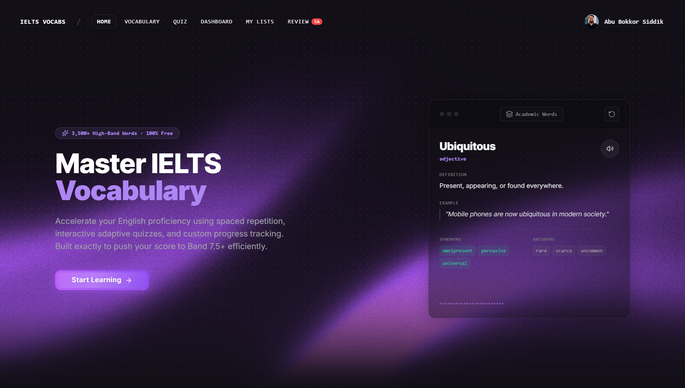
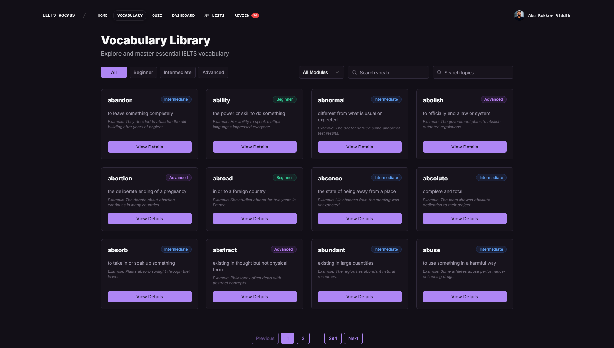
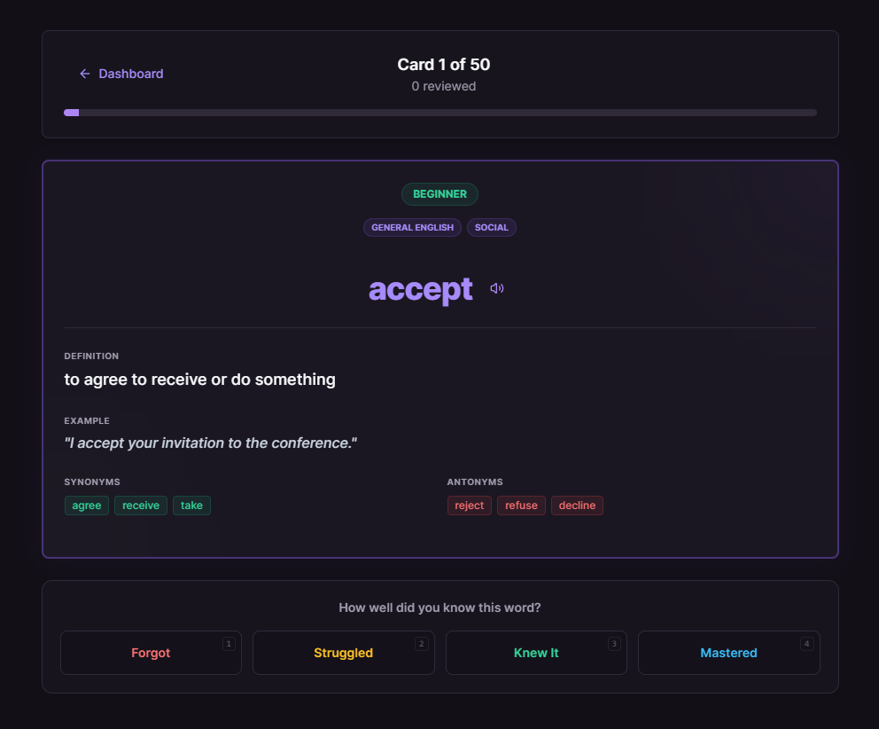
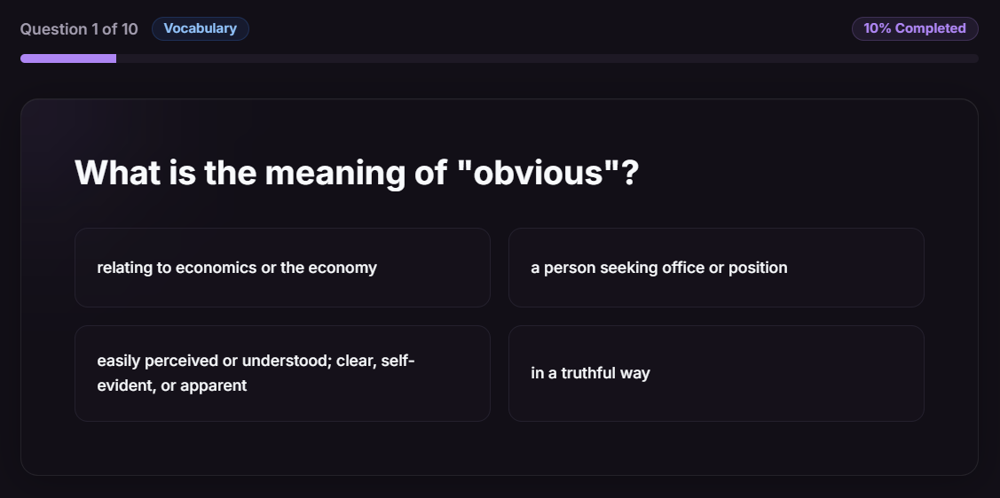
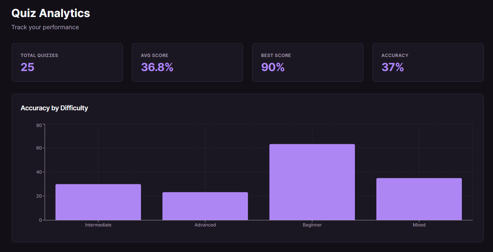

# IELTS Vocabulary Learning Platform

A comprehensive, free web-based platform designed to help IELTS candidates master essential vocabulary through interactive learning, spaced repetition, and adaptive quizzes.

**Try it now:** [www.ieltsvocabs.com](https://www.ieltsvocabs.com)

> 🛠️ **Are you a developer or recruiter?** Check out the [Developer Guide (DEVELOPMENT.md)](DEVELOPMENT.md) for architecture, tech stack, API docs, setup instructions, and contribution guidelines.

## Table of Contents

- [The Story Behind This Project](#the-story-behind-this-project)
- [Getting Started](#getting-started)
- [Learning Features](#learning-features)
- [Best Learning Practices](#best-learning-practices)
- [Understanding Your Analytics](#understanding-your-analytics)
- [Accessibility](#accessibility)
- [Privacy & Data Security](#privacy--data-security)
- [FAQ](#faq)
- [License](#license)
- [Contact & Support](#contact--support)

## The Story Behind This Project

When I decided to improve my English and prepare for the IELTS exam, I searched for quality vocabulary learning resources. To my disappointment, I found that most available IELTS vocabulary apps were behind paywalls, with very few free alternatives that met my learning needs.

This frustration became my motivation. I realized that many aspiring IELTS candidates face the same challenge - the financial barrier to accessing quality learning resources. I didn't want others to experience the same hassle and stress I went through.

That's when I decided to build this platform: a completely free, comprehensive IELTS vocabulary learning website that would eliminate these barriers and provide everyone with the tools they need to succeed, without any cost or compromise on quality.

## Getting Started

### Creating Your Account

1. Navigate to the user app
2. Click on "Register" in the navigation bar
3. Fill in your details (name, email, password)
4. A verification email is automatically sent to your inbox - click the link to verify your account
5. Log in to access your personalized dashboard

> **Note:** Email verification is required before you can change your password or receive learning reminder emails. You can resend the verification email from your profile page at any time.

### First-Time User Journey

After logging in, you'll see your dashboard with:

- **Your Stats**: XP (experience points), current streak, quiz performance
- **Review Cards**: Number of vocabulary words due for review today
- **Quick Actions**: Direct access to vocabulary library, review sessions, and quizzes

## Learning Features

### Vocabulary Library

Browse and explore over 3500+ IELTS vocabulary words organized by:

- **Difficulty Levels**: Beginner, Intermediate, Advanced
- **IELTS Modules**: Reading, Writing, Listening, Speaking
- **Topics**: Business, Education, Environment, Health, Technology, and more
- **Search**: Find specific words or filter by synonyms/antonyms

Each vocabulary entry includes:

- Word definition and meaning
- Example sentences in context
- Synonyms and antonyms
- Part of speech
- Audio pronunciation (UK English)

### Personal Word Lists

Organize your vocabulary with custom lists:

- **Create Custom Lists**: Group words by theme, difficulty, or any category you prefer (e.g., "Writing Words", "Hard Words", "Topic: Environment")
- **Bookmark Any Word**: Save words directly from the vocabulary library with one click
- **One Word, One List**: Each word belongs to a single list. Saving a word to a different list automatically moves it, keeping your collections clean
- **Manage Your Lists**: Rename or delete lists from the dedicated "My Lists" page
- **Quick Access**: View all your saved words organized by list, with word details available on tap

**How to Use:**

1. Browse the vocabulary library and find a word you want to save
2. Click the bookmark icon on any word card or in the word details modal
3. Select an existing list or create a new one
4. Access all your lists from the "My Lists" page in the navigation

### Spaced Repetition System (SRS)

Our SRS feature uses a scientifically-proven algorithm to optimize your learning retention:

**How It Works:**

1. When you first encounter a word, it's added to your learning queue
2. After reviewing, you rate how well you knew the word (1-5 scale)
3. Based on your rating, the system schedules the next review
4. Words you struggle with appear more frequently
5. Words you master appear less often, but at optimal intervals

**Review Schedule:**

- New words: Reviewed within 1 day
- Learning words: Reviewed every 1-10 days based on performance
- Reviewing words: Reviewed every 10-30 days
- Mastered words: Reviewed occasionally to maintain retention

**Quality Ratings:**

After seeing each word, rate yourself using one of four buttons:

- **Forgot**: You didn't remember the word at all - it will be shown again soon
- **Struggled**: You got it right but had to think hard - the system will review it more frequently
- **Knew It**: You remembered after a brief pause - the review interval grows normally
- **Mastered**: You knew it instantly and confidently - the interval grows faster

### Quiz System

Test your knowledge with adaptive quizzes:

**Difficulty Levels:**

- **Beginner**: Basic vocabulary with simpler questions
- **Intermediate**: Moderate difficulty with context-based questions
- **Advanced**: Challenging vocabulary and complex scenarios
- **Mixed**: Random difficulty for comprehensive practice

**Question Types:**

- Multiple choice definitions
- Synonym identification
- Antonym selection
- Fill-in-the-blank with context
- Meaning in context

**Scoring & XP:**

- Correct answers earn experience points (XP)
- Maintain daily streaks for bonus XP
- Quiz performance tracked in analytics
- Personalized difficulty recommendations based on performance

### Progress Tracking

Monitor your learning journey through comprehensive analytics:

- **XP System**: Earn points for quizzes and reviews
- **Daily Streaks**: Build consistency with daily practice
- **Quiz Analytics**: Track accuracy, average scores, and improvement trends
- **SRS Statistics**: Monitor cards in different learning stages
- **Review Schedule**: See upcoming reviews for the next 7 days

### Profile Management

Customize your learning experience:

- **Profile Picture**: Upload a custom avatar via Cloudinary (signed uploads for security)
- **Update Name**: Change your display name
- **Change Password**: Securely update your password (requires email verification)
- **Change Email**: Request an email change - a verification link is sent to the new address, and a security alert is sent to the old address
- **Email Verification**: Verify your email to unlock full account features; resend verification at any time
- View learning statistics and track achievement milestones

### Feedback System

Help improve the platform by submitting feedback directly from the app:

- **Feedback Types**: Love it, Needs Improvement, Feature Request, Bug Report
- **Rating**: Rate your experience from 1 to 5 stars
- **Message**: Describe your feedback in detail
- **Device Info**: Automatically captured for bug reports
- Feedback is reviewed and managed by admins

### Smart Learning Reminders

Stay on track with automated inactivity reminder emails:

- **3-Day Reminder**: A gentle nudge if you haven't practiced in 3 days
- **7-Day Reminder**: A stronger reminder after a full week of inactivity
- **10-Day Reminder**: A final push to bring you back before progress fades
- Only sent to verified email addresses
- Reminders can be turned off in your account settings

### IELTS Guides & Resources

Boost your preparation with comprehensive, interactive guides:

- **IELTS Test Format**: Detailed breakdown of Academic vs. General Training, listening/reading band score conversions, and test modules.
- **Assessment Criteria**: Deep-dive into Writing and Speaking band descriptors, with simplified explanations of Band 9 standards.
- **Methodology & Strategies**: Actionable advice on vocabulary acquisition strategies and maximizing the Spaced Repetition System.
- **Unified Band Tables**: Interactive tools to query Band score requirements and requirements for each scoring criteria.

### Platform & Auxiliary Pages

Access core pages built to enhance your overall platform experience:

- **About Page**: Learn about the platform's vision, creation history, and core objectives.
- **Contact & Feedback**: Send queries directly or provide feedback to help improve the learning experience.
- **Privacy Policy & Terms of Service**: Read about data security, rights, and usage rules.

## Best Learning Practices

### Recommended Daily Routine

#### Morning (10-15 minutes)

1. Complete all due SRS reviews
2. Add 5-10 new words from the vocabulary library

#### Afternoon/Evening (15-20 minutes)

1. Take one quiz at your current difficulty level
2. Review any words you got wrong in the quiz
3. Browse vocabulary library for new words related to your weak topics

**Consistency Tips:**

- Maintain a daily streak, even if just 5 minutes
- Don't skip SRS reviews - they're scheduled at optimal intervals
- Quality over quantity: Better to learn 5 words well than 20 poorly

### Maximizing SRS Effectiveness

1. **Be Honest with Ratings**: Accurate self-assessment is crucial

   - Don't inflate your ratings - it will hurt retention
   - If you hesitated, it's not a 5

2. **Review Context**: Always read the example sentence

   - Understanding usage is more important than memorizing definitions

3. **Use Active Recall**: Try to remember before looking at the answer

   - Cover the answer and test yourself
   - Engage with the word actively

4. **Regular Sessions**: Review daily, even if briefly

   - Consistency beats cramming
   - Spaced repetition works best with regular intervals

5. **Don't Reset Progress**: Stick with the schedule
   - Trust the algorithm
   - Temporary forgetting is part of the learning process

### Combining Features for Maximum Impact

#### Week 1-2: Foundation

- Focus on beginner difficulty vocabulary
- Add 10-15 new words daily to SRS
- Take beginner quizzes to build confidence
- Aim for 80%+ accuracy before advancing

#### Week 3-4: Progression

- Mix beginner and intermediate vocabulary
- Maintain daily SRS reviews (critical phase)
- Take intermediate quizzes
- Review quiz mistakes and add to SRS

#### Week 5+: Mastery

- Focus on intermediate and advanced vocabulary
- Continue daily SRS reviews (this never stops)
- Take mixed difficulty quizzes
- Identify weak topics and target them specifically

### Tips for Maximum Learning Outcomes

1. **Focus on Weak Areas**: Use analytics to identify struggling topics
2. **Context is King**: Always learn words in sentences, not isolation
3. **Regular Review**: Don't let SRS reviews pile up
4. **Active Usage**: Try using new words in writing practice
5. **Topic Clustering**: Learn related words together (e.g., all environment vocabulary)
6. **Patience**: Language learning is a marathon, not a sprint

### Understanding Difficulty Progression

- **Beginner**: Common words, basic meanings (Band 5-6 level)
- **Intermediate**: Less common words, multiple meanings (Band 6.5-7 level)
- **Advanced**: Academic/sophisticated vocabulary (Band 7.5+ level)

Don't rush to advanced difficulty. Master each level thoroughly.

## Understanding Your Analytics

### XP (Experience Points)

**What is XP?**
XP represents your overall learning effort and achievement on the platform.

**How to Earn XP:**

- Complete quizzes (XP based on score and difficulty)
- Maintain daily streaks (bonus XP)
- Review SRS cards (consistent practice)

**Why it Matters:**
XP reflects consistency and effort, not just correctness. It motivates regular practice.

### Streak System

**What is a Streak?**
A streak counts consecutive days you've been active on the platform using your local timezone.

**How to Maintain:**

- Complete at least one quiz OR
- Review at least one SRS card per day

**Timezone Intelligence:**

- Streaks are tracked in your local timezone (automatically detected)
- Works correctly even when traveling between timezones
- Midnight boundaries calculated based on your location
- No manual timezone configuration needed

**Benefits:**

- Builds habit consistency
- Bonus XP multipliers
- Psychological motivation

**Streak Resets:**

- Streak resets after 2+ days of inactivity
- Automatic reset happens when you access the dashboard after 2+ missed days
- Grace period: you have until the end of the next calendar day to keep your streak
- Set daily reminders to maintain momentum

### Quiz Performance Metrics

**Average Score:**

- Your mean score across all quizzes
- Tracked separately by difficulty level
- Target: 80%+ before moving to next difficulty

**Total Quizzes:**

- Number of quizzes completed
- More practice = better retention

**Score Trends:**

- Upward trend indicates improvement
- Plateau suggests need for difficulty adjustment
- Downward trend may indicate too fast progression

### SRS Statistics Interpretation

**Card Distribution:**

- **New**: Words you haven't reviewed yet
- **Learning**: Words you're actively learning (0-10 day intervals)
- **Reviewing**: Words you know but need periodic review (10-30 days)
- **Mastered**: Words with strong retention (30+ days)

**Healthy Distribution:**

- New: 5-10% (continuous fresh learning)
- Learning: 40-50% (active study phase)
- Reviewing: 30-40% (reinforcement phase)
- Mastered: 10-20% (achievement)

**Due Count:**
Number of cards scheduled for review today. Aim to complete all daily reviews for optimal results.

**Recommended Review Schedule:**
View your next 7 days of scheduled reviews to plan study time effectively.

## Accessibility

### WCAG Compliance

This platform strives for WCAG 2.1 Level AA compliance:

**Implemented Features:**

- Semantic HTML structure
- ARIA labels and roles where necessary
- Color contrast ratios meet AA standards
- Focus indicators for keyboard navigation
- Alt text for images (when implemented)

**Keyboard Navigation:**

- Tab navigation through all interactive elements
- Enter/Space for button activation
- Escape to close modals
- Arrow keys for navigation where applicable

**Screen Reader Support:**

- Proper heading hierarchy
- Descriptive link text
- Form labels and error messages
- Status announcements for dynamic content

**Ongoing Improvements:**

- Regular accessibility audits
- User testing with assistive technologies
- Continuous refinement based on feedback

## Privacy & Data Security

### Data Handling Practices

**User Data Collection:**

- Minimal data collection (name, email, learning progress)
- No third-party tracking or analytics (currently)
- Data used solely for platform functionality

**Data Storage:**

- Passwords hashed with industry-standard algorithms
- Secure token-based authentication
- Database hosted on secure cloud infrastructure

**User Rights:**

- Account deletion on request
- Data export available on request
- No data sale or sharing with third parties

## FAQ

**Q: Is this platform completely free?**
A: Yes, 100% free with no hidden costs or premium features. All vocabulary and features are available to everyone.

**Q: How many words are in the vocabulary library?**
A: Currently 3500+ IELTS-relevant words, regularly updated with new content.

**Q: Do I need to create an account?**
A: Yes, an account is required to track your progress, use SRS, and save quiz scores.

**Q: How does the spaced repetition system work?**
A: SRS uses a scientifically-proven algorithm to schedule reviews at optimal intervals based on your performance. Words you struggle with appear more frequently.

**Q: Can I use this on mobile devices?**
A: Yes, the web app is fully responsive and works on all devices. A native mobile app is planned for the future.

**Q: What happens if I miss a day of reviews?**
A: Your streak resets, but your SRS progress remains intact. Overdue reviews accumulate, so try to catch up gradually.

**Q: Can I export my progress?**
A: Currently not available, but this feature is planned for future releases.

**Q: Is my data safe?**
A: Yes, we use industry-standard security practices. Passwords are hashed, and data is never shared with third parties.

## License

This project is licensed under a custom proprietary license for **personal and educational use only**.

### License Summary

- **Allowed:** Personal and educational use.
- **Prohibited:** Commercial use, redistribution, modification and distribution of modified copies without explicit permission.

See the [LICENSE](LICENSE) file for full details.

## Contact & Support

### Get Help

**Documentation:**

- Read this README for learner guidance
- Check the [FAQ](#faq) section
- Developers: see [DEVELOPMENT.md](DEVELOPMENT.md) for technical docs

**Issues:**

- Report bugs via [GitHub Issues](https://github.com/Abubokkor98/ielts-word-trainer/issues)
- Search existing issues before creating new ones
- Provide detailed information and reproduction steps

**Discussions:**

- Ask questions in [GitHub Discussions](https://github.com/Abubokkor98/ielts-word-trainer/discussions)
- Share ideas and suggestions
- Help other community members

### Connect

**Developer:**

- GitHub: [@Abubokkor98](https://github.com/Abubokkor98)
- LinkedIn: [Abu Bokkor Siddik](https://www.linkedin.com/in/abubokkor)
- Email: [mail.abubokkor@gmail.com](mailto:mail.abubokkor@gmail.com)

**Project Repository:**

- [https://github.com/Abubokkor98/ielts-word-trainer](https://github.com/Abubokkor98/ielts-word-trainer)

---

**Built with dedication to make IELTS preparation accessible to everyone.**

**Star this repository if you find it helpful!**
