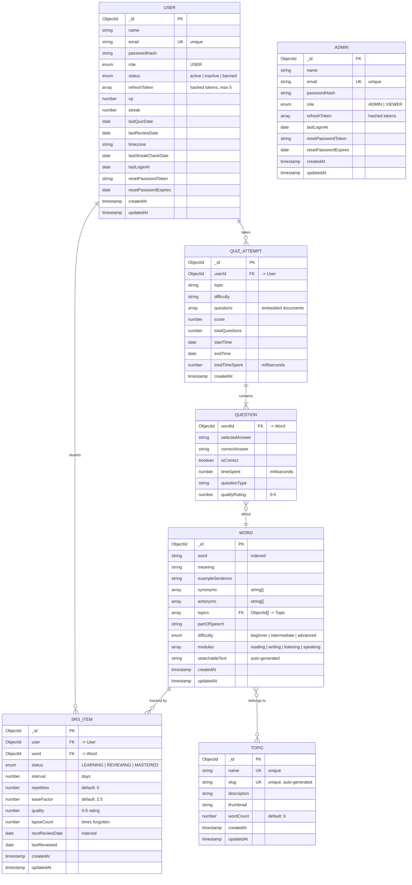

# Backend Database Schema (ERD)

> **How to view:** Copy the Mermaid code below and paste it into [mermaid.live](https://mermaid.live) to get a visual diagram, or view directly in GitHub/VS Code with Mermaid support.

## Entity Relationship Diagram

## Table Definitions

### USER

| Field                 | Type     | Constraints               | Description                   |
| --------------------- | -------- | ------------------------- | ----------------------------- |
| `_id`                 | ObjectId | PK                        | Primary key                   |
| `name`                | String   | required                  | User's display name           |
| `email`               | String   | required, unique, indexed | Login identifier              |
| `passwordHash`        | String   | required                  | bcrypt hashed password        |
| `role`                | Enum     | default: USER             | USER                          |
| `status`              | Enum     | default: active           | active, inactive, banned      |
| `refreshToken`        | String[] | default: []               | Hashed refresh tokens (max 5) |
| `xp`                  | Number   | default: 0                | Experience points             |
| `streak`              | Number   | default: 0                | Current learning streak       |
| `lastQuizDate`        | Date     | optional                  | Last quiz completion          |
| `lastReviewDate`      | Date     | optional                  | Last SRS review               |
| `timezone`            | String   | optional                  | User's timezone (IANA)        |
| `lastStreakCheckDate` | Date     | optional                  | Optimization field            |
| `lastLoginAt`         | Date     | optional                  | Last login timestamp          |

### ADMIN

| Field          | Type     | Constraints               | Description            |
| -------------- | -------- | ------------------------- | ---------------------- |
| `_id`          | ObjectId | PK                        | Primary key            |
| `name`         | String   | required                  | Admin name             |
| `email`        | String   | required, unique, indexed | Login identifier       |
| `passwordHash` | String   | required                  | bcrypt hashed password |
| `role`         | Enum     | default: ADMIN            | ADMIN, VIEWER          |
| `refreshToken` | String[] | default: []               | Hashed refresh tokens  |
| `lastLoginAt`  | Date     | optional                  | Last login timestamp   |

### WORD

| Field             | Type       | Constraints             | Description                           |
| ----------------- | ---------- | ----------------------- | ------------------------------------- |
| `_id`             | ObjectId   | PK                      | Primary key                           |
| `word`            | String     | required, indexed       | The vocabulary word                   |
| `meaning`         | String     | required                | Definition                            |
| `exampleSentence` | String     | required                | Usage example                         |
| `synonyms`        | String[]   | required                | Related words                         |
| `antonyms`        | String[]   | required                | Opposite words                        |
| `topics`          | ObjectId[] | required, ref: Topic    | Topic associations                    |
| `partOfSpeech`    | String     | required                | noun, verb, adj, etc.                 |
| `difficulty`      | Enum       | required                | beginner, intermediate, advanced      |
| `modules`         | String[]   | required                | reading, writing, listening, speaking |
| `searchableText`  | String     | auto-generated, indexed | Search optimization                   |

### TOPIC

| Field         | Type     | Constraints               | Description              |
| ------------- | -------- | ------------------------- | ------------------------ |
| `_id`         | ObjectId | PK                        | Primary key              |
| `name`        | String   | required, unique, indexed | Topic name               |
| `slug`        | String   | required, unique, indexed | URL-friendly name (auto) |
| `description` | String   | optional                  | Topic description        |
| `thumbnail`   | String   | optional                  | Image URL                |
| `wordCount`   | Number   | default: 0                | Words in topic           |

### SRS_ITEM

| Field            | Type     | Constraints                  | Description                   |
| ---------------- | -------- | ---------------------------- | ----------------------------- |
| `_id`            | ObjectId | PK                           | Primary key                   |
| `user`           | ObjectId | required, ref: User, indexed | User reference                |
| `word`           | ObjectId | required, ref: Word          | Word reference                |
| `status`         | Enum     | default: LEARNING            | LEARNING, REVIEWING, MASTERED |
| `interval`       | Number   | default: 0                   | Days until next review        |
| `repetition`     | Number   | default: 0                   | Successful repetitions        |
| `easeFactor`     | Number   | default: 2.5                 | SM-2 ease factor              |
| `quality`        | Number   | default: 0                   | Last review quality (0-5)     |
| `lapseCount`     | Number   | default: 0                   | Times forgotten               |
| `nextReviewDate` | Date     | default: now, indexed        | Next scheduled review         |
| `lastReviewed`   | Date     | default: now                 | Last review timestamp         |

**Indexes:** `{user, word}` (unique compound), `{user, status}`, `{user, nextReviewDate, status}`

### QUIZ_ATTEMPT

| Field            | Type     | Constraints                  | Description            |
| ---------------- | -------- | ---------------------------- | ---------------------- |
| `_id`            | ObjectId | PK                           | Primary key            |
| `userId`         | ObjectId | required, ref: User, indexed | User reference         |
| `topic`          | String   | optional                     | Quiz topic filter      |
| `difficulty`     | String   | optional                     | Quiz difficulty filter |
| `questions`      | Object[] | embedded                     | Question documents     |
| `score`          | Number   | required                     | Correct answers count  |
| `totalQuestions` | Number   | required                     | Total questions        |
| `startTime`      | Date     | required                     | Quiz start             |
| `endTime`        | Date     | required                     | Quiz end               |
| `totalTimeSpent` | Number   | required                     | Duration in ms         |

**Indexes:** `{userId, createdAt: -1}`

## Relationships

| From         | To           | Type | Description                           |
| ------------ | ------------ | ---- | ------------------------------------- |
| USER         | SRS_ITEM     | 1:N  | User studies many words               |
| USER         | QUIZ_ATTEMPT | 1:N  | User takes many quizzes               |
| WORD         | SRS_ITEM     | 1:N  | Word tracked for many users           |
| WORD         | TOPIC        | N:M  | Words belong to multiple topics       |
| QUIZ_ATTEMPT | QUESTION     | 1:N  | Attempt contains questions (embedded) |
| QUESTION     | WORD         | N:1  | Question references a word            |
