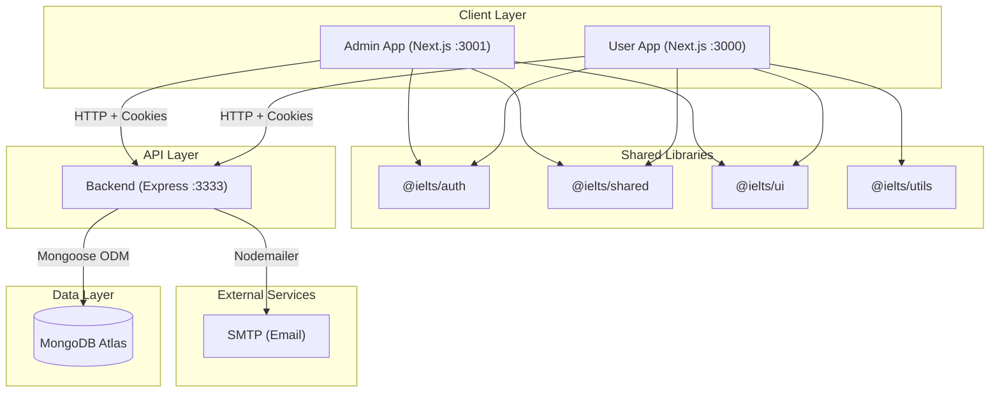
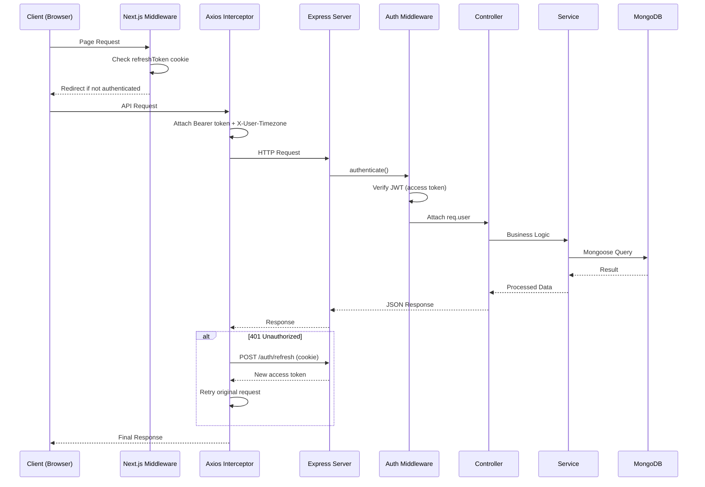

# System Architecture

## Overview

IELTS Word Trainer is a full-stack vocabulary learning platform built as an **Nx monorepo**. The system consists of three applications and four shared libraries, all managed within a single repository.

## Architecture Diagram

## Tech Stack

| Layer         | Technology                                  |
| ------------- | ------------------------------------------- |
| Frontend      | Next.js 16, React 19, TypeScript 5.9        |
| UI Framework  | Chakra UI v2, Tailwind CSS v3               |
| State         | Zustand (persisted), TanStack React Query   |
| HTTP Client   | Axios (with interceptors)                   |
| Backend       | Express 4, TypeScript, Node.js 20           |
| Database      | MongoDB (Mongoose 9 ODM)                    |
| Auth          | JWT (jsonwebtoken), bcryptjs                |
| Validation    | Zod v4                                      |
| Monorepo      | Nx 22, pnpm workspaces                      |
| Linting       | Biome v2                                    |
| Logging       | Winston, Morgan                             |
| Deployment    | Vercel (frontend), Docker (backend)         |

## Request Lifecycle

## Application Boundaries

### User App (`:3000`)
- Public pages: Landing, Vocabulary browse, Quiz (unauthenticated)
- Protected pages: Dashboard, Analytics, Profile, Review
- Uses Next.js middleware for route protection via cookie detection

### Admin App (`:3001`)
- All pages require admin/super_admin authentication
- Dashboard analytics, user management, vocabulary CRUD
- Viewer (demo) accounts have read-only access

### Backend API (`:3333`)
- RESTful API versioned at `/api/v1`
- Stateless — all auth via JWT in httpOnly cookies
- Rate limiting per endpoint tier (light/moderate/strict)
- CORS configured for both frontend origins

## Shared Libraries

| Library        | Purpose                                              |
| -------------- | ---------------------------------------------------- |
| `@ielts/auth`  | Zustand auth store, Axios instance, auth hooks, HOCs |
| `@ielts/shared`| Enums, Zod schemas, SRS constants, quiz store        |
| `@ielts/ui`    | Reusable UI components (Sidebar, Pagination, Modals) |
| `@ielts/utils` | Utility functions shared across apps                 |
