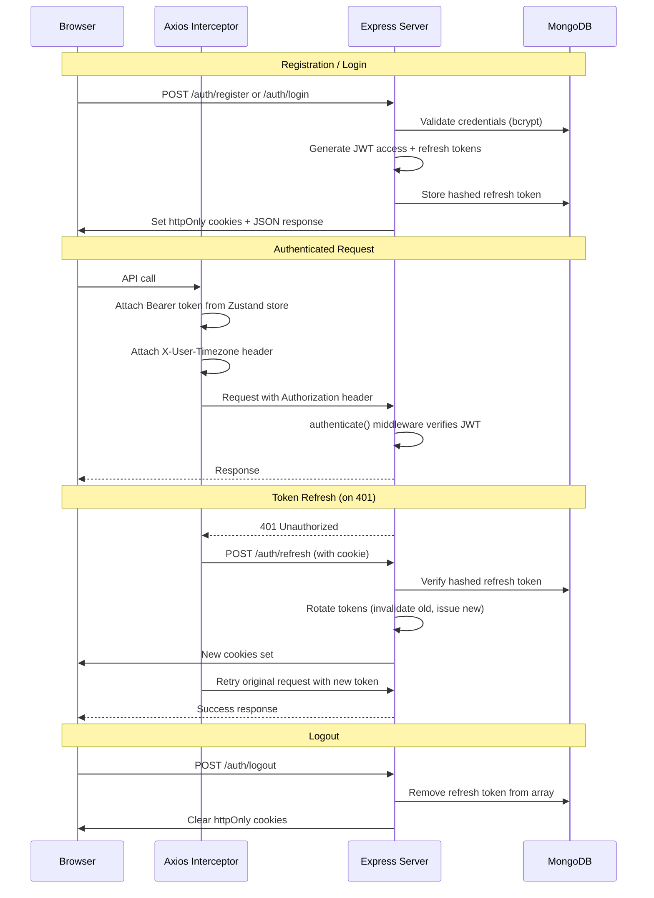

# Authentication Flow

## Overview

IELTS Word Trainer uses a **JWT-based authentication** system with **access + refresh token rotation**, delivered via **httpOnly cookies**. The system supports two separate user pools: **Users** (learners) and **Admins** (content managers).

## Token Architecture

| Token          | Type     | Expiry   | Storage            | Purpose                    |
| -------------- | -------- | -------- | ------------------ | -------------------------- |
| Access Token   | JWT      | 15 min   | httpOnly cookie    | Authenticate API requests  |
| Refresh Token  | JWT      | 7 days   | httpOnly cookie    | Obtain new access tokens   |

- Access tokens contain: `{ id, role, tokenType: 'access' }`
- Refresh tokens contain: `{ id, role, tokenType: 'refresh' }`
- Refresh tokens are **bcrypt-hashed** before storage in the database
- Maximum **5 active sessions** per user (oldest tokens pruned on new login)

## Authentication Flow Diagram



## Backend Middleware Chain

### `authenticate` Middleware
1. Extracts token from `Authorization: Bearer <token>` header or `accessToken` cookie
2. Verifies JWT signature using `JWT_SECRET`
3. Rejects refresh tokens used as access tokens (`tokenType` check)
4. Validates role exists in `UserRole` or `AdminRole` enum
5. Attaches `req.user = { id, role }` to the request

### `authorize(roles)` Middleware
Takes an array of allowed roles and returns 403 if the user's role is not included.

### `requireWriteAccess` Middleware
Blocks all non-GET requests from `AdminRole.VIEWER` (demo accounts). Returns 403 with a descriptive message.

## Frontend Auth Architecture

### Zustand Auth Store (`libs/auth/src/lib/auth.store.ts`)
```
AuthState {
  user: { id, name, email, role, xp, streak } | null
  accessToken: string | null
  hasHydrated: boolean          // SSR hydration flag
  setUser(user) → void
  setToken(token) → void
  logout() → void
}
```
Persisted to `localStorage` under key `auth-storage`.

### Axios Interceptor (`libs/auth/src/lib/api.ts`)

**Request Interceptor:**
- Attaches `Bearer <token>` from Zustand store
- Auto-detects and sends `X-User-Timezone` header via `Intl.DateTimeFormat`

**Response Interceptor (401 handling):**
1. On receiving 401, checks if this is a retryable request
2. Skips refresh for login/logout/password endpoints
3. Uses a **shared promise** to prevent concurrent refresh calls
4. Determines correct refresh endpoint (`/auth/refresh` vs `/admin/refresh`)
5. On refresh success: updates Zustand store, retries original request
6. On refresh failure (401/403): logs out user, redirects to home

### Route Protection

**Middleware-level** (`proxy.ts`):
- Checks for `refreshToken` cookie existence (not validity)
- Redirects unauthenticated users from protected routes to `/login?redirect=<path>`
- Redirects authenticated users away from auth routes to `/dashboard`

**Component-level** HOCs (`libs/auth/src/lib/hooks.tsx`):
- `protectUserRoute(Component)` — Wraps pages for user-only access
- `protectAdminRoute(Component)` — Wraps pages for admin/super_admin access
- Cross-app redirect: admins on user app → admin app, users on admin app → user app

## Cookie Configuration

Cookies are set via `setAuthCookies()` in `apps/backend/src/shared/cookies.ts`:
- `httpOnly: true` — Not accessible via JavaScript
- `secure: true` in production — HTTPS only
- `sameSite: 'strict'` in production — CSRF protection
- `path: '/'` — Available to all routes

## Password Reset Flow

1. User submits email to `POST /password/forgot-password`
2. Backend generates a random token, hashes it, stores hash + expiry on user document
3. Backend sends email with reset link containing the plain token
4. User clicks link → `POST /password/reset-password` with token + new password
5. Backend validates token against stored hash, checks expiry, updates password
6. Token is cleared from database after use

## Admin Authentication

Admin auth uses the same JWT mechanism but with:
- Separate `Admin` model (not the `User` model)
- Separate routes under `/api/v1/admin/login`, `/api/v1/admin/refresh`
- Three roles: `super_admin`, `admin`, `viewer`
- Only `super_admin` can create/modify other admins
