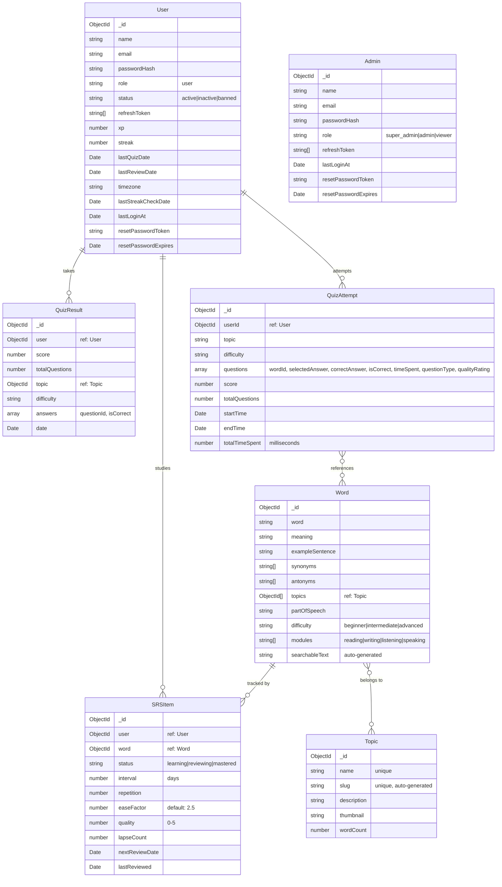

# Database Schema

## Overview

The application uses **MongoDB** as its primary database with **Mongoose 9** as the ODM. All models use TypeScript interfaces extending `Document` and are defined as Mongoose schemas with strict typing.

## Entity Relationship Diagram



## Model Details

### User (`users` collection)

**File:** `apps/backend/src/modules/users/users.model.ts`

| Field                  | Type       | Required | Default    | Index   | Notes                           |
| ---------------------- | ---------- | -------- | ---------- | ------- | ------------------------------- |
| `name`                 | String     | Yes      | —          | —       |                                 |
| `email`                | String     | Yes      | —          | unique  | Primary login identifier        |
| `passwordHash`         | String     | Yes      | —          | —       | bcrypt hashed password          |
| `role`                 | String     | No       | `'user'`   | —       | Enum: `UserRole`                |
| `status`               | String     | No       | `'active'` | —       | `active`, `inactive`, `banned`  |
| `refreshToken`         | String[]   | No       | `[]`       | —       | Hashed refresh tokens (max 5)   |
| `xp`                   | Number     | No       | `0`        | —       | Experience points               |
| `streak`               | Number     | No       | `0`        | —       | Consecutive active days         |
| `lastQuizDate`         | Date       | No       | —          | —       | Last quiz completion date       |
| `lastReviewDate`       | Date       | No       | —          | —       | Last SRS review date            |
| `timezone`             | String     | No       | —          | —       | IANA timezone string            |
| `lastStreakCheckDate`   | Date       | No       | —          | —       | Optimization: skip daily check  |
| `lastLoginAt`          | Date       | No       | —          | —       | Updated on login/refresh        |
| `resetPasswordToken`   | String     | No       | —          | —       | Hashed password reset token     |
| `resetPasswordExpires` | Date       | No       | —          | —       | Token expiration timestamp      |

Auto-managed: `createdAt`, `updatedAt` (via `timestamps: true`)

---

### Admin (`admins` collection)

**File:** `apps/backend/src/modules/admin/admin.model.ts`

| Field                  | Type       | Required | Default    | Index   | Notes                           |
| ---------------------- | ---------- | -------- | ---------- | ------- | ------------------------------- |
| `name`                 | String     | Yes      | —          | —       |                                 |
| `email`                | String     | Yes      | —          | unique  |                                 |
| `passwordHash`         | String     | Yes      | —          | —       | bcrypt hashed                   |
| `role`                 | String     | No       | `'admin'`  | —       | `super_admin`, `admin`, `viewer`|
| `refreshToken`         | String[]   | No       | `[]`       | —       | Max 5 sessions                  |
| `lastLoginAt`          | Date       | No       | —          | —       |                                 |
| `resetPasswordToken`   | String     | No       | —          | —       |                                 |
| `resetPasswordExpires` | Date       | No       | —          | —       |                                 |

---

### Word (`words` collection)

**File:** `apps/backend/src/modules/words/words.model.ts`

| Field              | Type         | Required | Index              | Notes                           |
| ------------------ | ------------ | -------- | ------------------ | ------------------------------- |
| `word`             | String       | Yes      | Yes                | The vocabulary word             |
| `meaning`          | String       | Yes      | —                  | Word definition                 |
| `exampleSentence`  | String       | Yes      | —                  | Usage in context                |
| `synonyms`         | String[]     | Yes      | —                  |                                 |
| `antonyms`         | String[]     | Yes      | —                  |                                 |
| `topics`           | ObjectId[]   | Yes      | Yes                | Ref: `Topic` (min 1 required)   |
| `partOfSpeech`     | String       | Yes      | —                  | noun, verb, adj, etc.           |
| `difficulty`       | String       | Yes      | compound           | `beginner`, `intermediate`, `advanced` |
| `modules`          | String[]     | Yes      | Yes                | IELTS modules (min 1 required)  |
| `searchableText`   | String       | No       | Yes                | Auto-populated on save          |

**Indexes:**
- Compound: `{ difficulty: 1, modules: 1 }`
- `searchableText` — for efficient full-text search

**Pre-save Hook:** Auto-populates `searchableText` by joining `word + synonyms + antonyms` (lowercased).

---

### Topic (`topics` collection)

**File:** `apps/backend/src/modules/topics/topics.model.ts`

| Field         | Type   | Required | Index  | Notes                     |
| ------------- | ------ | -------- | ------ | ------------------------- |
| `name`        | String | Yes      | unique | Topic display name        |
| `slug`        | String | Yes      | unique | URL-friendly slug         |
| `description` | String | No       | —      |                           |
| `thumbnail`   | String | No       | —      | Thumbnail image URL       |
| `wordCount`   | Number | No       | —      | Number of words in topic  |

**Pre-save Hook:** Auto-generates `slug` from `name` (lowercased, spaces → hyphens, special chars removed).

---

### QuizResult (`quizresults` collection)

**File:** `apps/backend/src/modules/quiz/quiz.model.ts`

| Field            | Type       | Required | Notes                    |
| ---------------- | ---------- | -------- | ------------------------ |
| `user`           | ObjectId   | Yes      | Ref: `User`              |
| `score`          | Number     | Yes      | Number of correct answers|
| `totalQuestions`  | Number     | Yes      |                          |
| `topic`          | ObjectId   | No       | Ref: `Topic`             |
| `difficulty`     | String     | No       | Enum: `Difficulty`       |
| `answers`        | Array      | No       | `{ questionId, isCorrect }` |
| `date`           | Date       | No       | Default: `Date.now`      |

---

### QuizAttempt (`quizattempts` collection)

**File:** `apps/backend/src/modules/quiz/quiz-attempt.model.ts`

| Field            | Type       | Required | Index  | Notes                     |
| ---------------- | ---------- | -------- | ------ | ------------------------- |
| `userId`         | ObjectId   | Yes      | Yes    | Ref: `User`               |
| `topic`          | String     | No       | —      | Topic name (denormalized) |
| `difficulty`     | String     | No       | —      |                           |
| `questions`      | Array      | Yes      | —      | See details below         |
| `score`          | Number     | Yes      | —      |                           |
| `totalQuestions`  | Number     | Yes      | —      |                           |
| `startTime`      | Date       | Yes      | —      |                           |
| `endTime`        | Date       | Yes      | —      |                           |
| `totalTimeSpent` | Number     | Yes      | —      | Milliseconds              |

**Questions Sub-document:**
```
{
  wordId: ObjectId (ref: Word, required)
  selectedAnswer: String (required)
  correctAnswer: String (required)
  isCorrect: Boolean (required)
  timeSpent: Number (milliseconds, default: 0)
  questionType: String (QuestionType enum)
  qualityRating: Number (0-5, for SM-2 integration)
}
```

**Indexes:**
- Compound: `{ userId: 1, createdAt: -1 }` — for paginated user history

---

### SRSItem (`srsitems` collection)

**File:** `apps/backend/src/modules/srs/srs.model.ts`

| Field            | Type       | Required | Default | Index  | Notes                     |
| ---------------- | ---------- | -------- | ------- | ------ | ------------------------- |
| `user`           | ObjectId   | Yes      | —       | Yes    | Ref: `User`               |
| `word`           | ObjectId   | Yes      | —       | —      | Ref: `Word`               |
| `status`         | String     | No       | `'learning'` | —  | `learning`, `reviewing`, `mastered` |
| `interval`       | Number     | No       | `0`     | —      | Days until next review    |
| `repetition`     | Number     | No       | `0`     | —      | Successful review count   |
| `easeFactor`     | Number     | No       | `2.5`   | —      | SM-2 ease factor          |
| `quality`        | Number     | No       | `0`     | —      | Last review quality (0-5) |
| `lapseCount`     | Number     | No       | `0`     | —      | Times forgotten           |
| `nextReviewDate` | Date       | No       | `now`   | Yes    | When to review next       |
| `lastReviewed`   | Date       | No       | `now`   | —      | Last review timestamp     |

**Indexes:**
- Compound unique: `{ user: 1, word: 1 }` — one SRS record per user-word pair
- Compound: `{ user: 1, status: 1 }` — for stats queries
- Compound: `{ user: 1, nextReviewDate: 1, status: 1 }` — for due words queries
