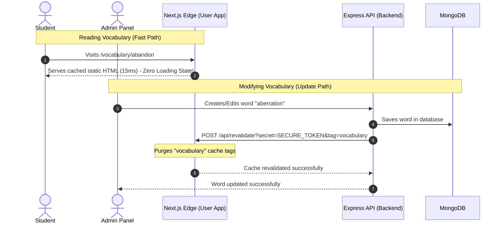

# Instant Vocabulary Loading Strategy: SSG + On-Demand Revalidation

This document details the architecture and implementation plan for achieving **instant vocabulary page loads (10–30ms) with zero client-side loading spinners or loading states**. 

Because vocabulary words are highly stable and updated very infrequently (e.g., once a month or year), we can leverage Next.js’s ultimate caching advantages to eliminate all dynamic database queries for end-users, serving fully compiled, static HTML directly from the CDN edge.

---

## 1. Core Architecture Overview

Instead of querying the database on every page visit or using short, wasteful time-based cache timers, the system will use a **Static-First Architecture** with **On-Demand Webhooks**:



---

## 2. Implementation Guide

### Step 1: Pre-render All Words at Build Time (SSG)

Currently, the user frontend only pre-renders the top 100 words during the build stage. To ensure *all* words load instantly without on-demand server rendering for the first user, we will expand `generateStaticParams` to fetch all vocabulary.

Edit the dynamic word detail page:
`apps/user/src/app/vocabulary/[id]/page.tsx`

```typescript
// Replace:
// const words = await serverVocabularyApi.getWords(1, 100);

// With:
// Fetch the entire dictionary (e.g., up to 5,000 words) so all pages compile statically
const words = await serverVocabularyApi.getWords(1, 5000); 
```

---

### Step 2: Tag Frontend Fetch Calls & Enable Infinite Cache

Update the Next.js data-fetching service to cache the words indefinitely (`revalidate: false`) and label the requests with cache tags.

Edit:
`apps/user/src/features/vocabulary/services/server-vocabulary.api.ts`

```typescript
export const serverVocabularyApi = {
  // 1. Fetching all words for static params
  getWords: async (page = 1, limit = 5000): Promise<Word[]> => {
    try {
      const response = await fetchWithTimeout(
        `${API_BASE_URL}/words?page=${page}&limit=${limit}`,
        {
          next: { 
            revalidate: false,      // Cache indefinitely
            tags: ['vocabulary']   // Tag cache for on-demand purging
          }, 
        }
      );
      // ...
    }
  },

  // 2. Fetching paginated listing pages
  getWordsPage: async (page = 1, limit = 12): Promise<VocabularyResponse> => {
    try {
      const response = await fetchWithTimeout(
        `${API_BASE_URL}/words?page=${page}&limit=${limit}`,
        {
          next: { 
            revalidate: false,      // Cache indefinitely
            tags: ['vocabulary']   // Tag cache
          },
        }
      );
      // ...
    }
  },

  // 3. Fetching single word details
  getWordById: async (id: string): Promise<Word | null> => {
    try {
      const response = await fetchWithTimeout(`${API_BASE_URL}/words/${id}`, {
        next: { 
          revalidate: false,        // Cache indefinitely
          tags: ['vocabulary', `word-${id}`] // Word-specific tag
        },
      });
      // ...
    }
  }
};
```

---

### Step 3: Create the Revalidation Endpoint (Next.js)

We need a secure webhook inside Next.js that the backend can ping to clear the cache.

Create a new route file:
`apps/user/src/app/api/revalidate/route.ts`

```typescript
import { revalidateTag } from 'next/cache';
import { NextRequest, NextResponse } from 'next/server';

export async function POST(request: NextRequest) {
  try {
    const { searchParams } = request.nextUrl;
    const tag = searchParams.get('tag');
    const secret = searchParams.get('secret');

    // 1. Validate the secret token
    if (secret !== process.env.REVALIDATION_SECRET_TOKEN) {
      return NextResponse.json(
        { success: false, message: 'Invalid revalidation secret' },
        { status: 401 }
      );
    }

    // 2. Validate the tag parameter
    if (!tag) {
      return NextResponse.json(
        { success: false, message: 'Missing "tag" parameter' },
        { status: 400 }
      );
    }

    // 3. Revalidate the specific cache tag
    revalidateTag(tag);

    return NextResponse.json({
      success: true,
      revalidated: true,
      tag,
      timestamp: Date.now(),
    });
  } catch (error) {
    const message = error instanceof Error ? error.message : 'Unknown error';
    return NextResponse.json(
      { success: false, message: `Revalidation failed: ${message}` },
      { status: 500 }
    );
  }
}
```

---

### Step 4: Hook Revalidation to Backend Updates (Express)

Whenever an admin adds, updates, or deletes a word, the Express backend will make a secure, fire-and-forget HTTP request to the Next.js revalidation endpoint to clear the cache.

#### A. Create a Webhook Helper
Create a helper utility on the backend:
`apps/backend/src/utils/revalidate.ts`

```typescript
import axios from 'axios';
import { Logger } from './logger';

const USER_APP_URL = process.env.USER_APP_URL || 'http://localhost:3000';
const REVALIDATION_SECRET_TOKEN = process.env.REVALIDATION_SECRET_TOKEN || '';

/**
 * Fires a background request to the user app's revalidation webhook to purge caches.
 */
export async function triggerCacheRevalidation(tag: string): Promise<void> {
  if (!REVALIDATION_SECRET_TOKEN) {
    Logger.warn('Skipping cache revalidation: REVALIDATION_SECRET_TOKEN is not defined.');
    return;
  }

  // Fire-and-forget in the background so we don't delay the admin saving action
  axios.post(`${USER_APP_URL}/api/revalidate?secret=${REVALIDATION_SECRET_TOKEN}&tag=${tag}`)
    .then(() => {
      Logger.info(`Successfully triggered cache revalidation for tag: ${tag}`);
    })
    .catch((error) => {
      Logger.error(`Failed to trigger cache revalidation for tag "${tag}":`, error.message);
    });
}
```

#### B. Hook Into the Words Service
Edit `apps/backend/src/modules/words/words.service.ts` to trigger revalidation on mutations:

```typescript
import { triggerCacheRevalidation } from '../../utils/revalidate';

export class WordsService {
  static async create(input: CreateWordInput) {
    const word = await Word.create(input);
    
    // Purge vocabulary lists and index caches
    triggerCacheRevalidation('vocabulary');
    
    return word;
  }

  static async update(id: string, input: Partial<CreateWordInput>) {
    const word = await Word.findByIdAndUpdate(id, input, { new: true });
    
    if (word) {
      // Purge listing page cache AND the specific word page cache
      triggerCacheRevalidation('vocabulary');
      triggerCacheRevalidation(`word-${word.word.toLowerCase()}`);
    }
    
    return word;
  }

  static async delete(id: string) {
    const word = await Word.findByIdAndDelete(id);
    
    if (word) {
      // Purge caches
      triggerCacheRevalidation('vocabulary');
      triggerCacheRevalidation(`word-${word.word.toLowerCase()}`);
    }
    
    return word;
  }
}
```

---

## 3. Benefits and Impact Analysis

### 🚀 Technical Benefits
1. **Sub-15ms Response Times:** Pages load immediately because the browser receives precompiled HTML.
2. **Zero Database Overhead:** End-user traffic hits Next.js’s memory cache directly. The database is only queried during builds or when an admin explicitly changes a word.
3. **Perfect Core Web Vitals:** Google SEO metrics (Largest Contentful Paint, Cumulative Layout Shift) will achieve perfect scores, elevating search result rankings.
4. **Resilient to Downtime:** Even if your Express backend or MongoDB database crashes temporarily, students can still browse and learn existing vocabulary uninterrupted.

### ⚠️ Tradeoffs
* **Longer Production Build Times:** Compiling 3,500+ static pages during `pnpm build` will take approximately 1–3 minutes depending on your server CPU. For a small/medium vocabulary database, this is highly manageable and fully acceptable.
