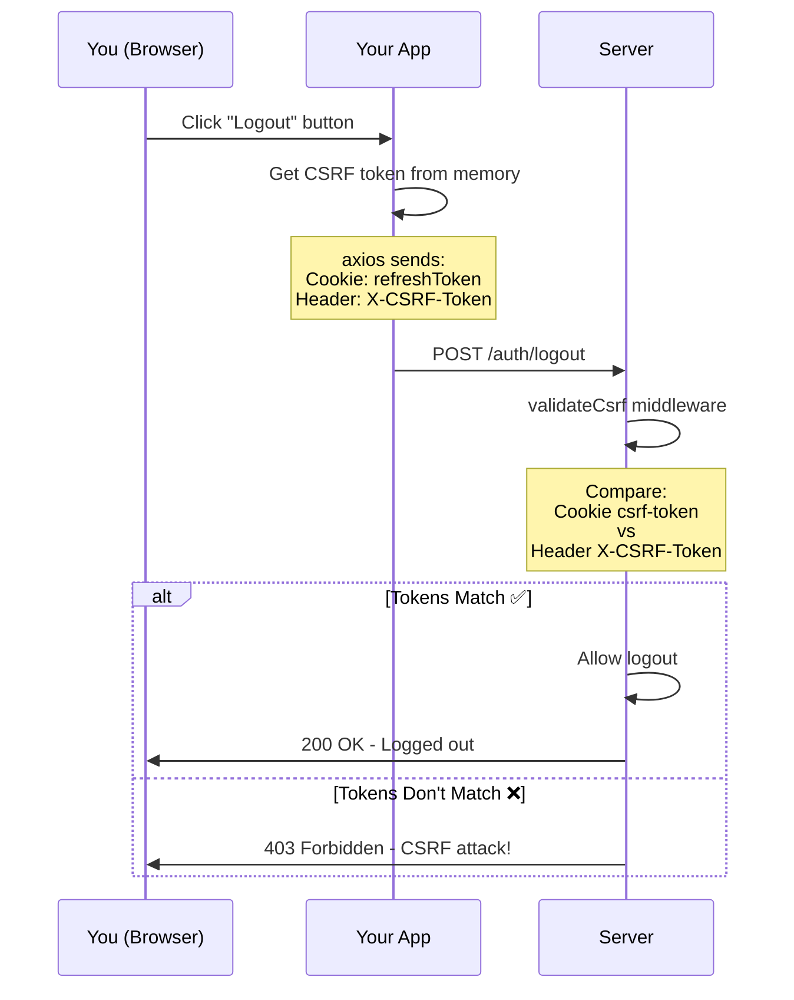
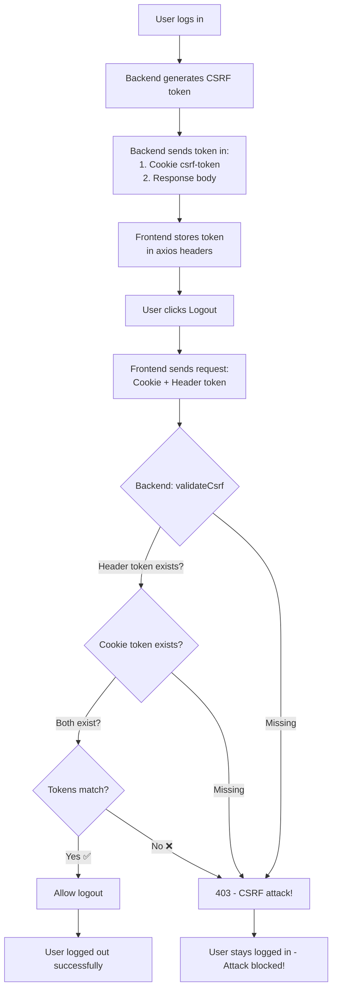

# 🛡️ CSRF Protection Explained (Beginner-Friendly)

## What is CSRF? (In Simple Terms)

**CSRF** = **C**ross-**S**ite **R**equest **F**orgery

**Simple explanation:** It's when a bad website tricks your browser into doing something on a good website where you're logged in.

---

## Real-World Analogy 🏦

Imagine you're logged into your bank's website in one browser tab.

**Without CSRF Protection:**

```text
You: *logged into BankApp.com*
Evil site: "Hey browser, send money from BankApp.com!"
Browser: "OK!" *sends cookies automatically*
Bank: "Cookies are valid, sending $1000..."
You: "Wait, I didn't do that!" ❌
```

**With CSRF Protection:**

```text
You: *logged into BankApp.com* → Gets secret token
Evil site: "Hey browser, send money from BankApp.com!"
Browser: *sends cookies but NO secret token*
Bank: "I see cookies but no token = REJECTED!" 🛡️
You: Safe! ✅
```

---

## How It Works in Your IELTS App

### Step 1: Login (You Get a Secret Token)

**Your code:** [`auth.controller.ts`](file:///d:/Projects/ielts-vocabs-app/apps/backend/src/modules/auth/auth.controller.ts)

```typescript
// When you login successfully:
static async login(req: Request, res: Response) {
  // 1. Validate credentials
  const { accessToken, refreshToken } = await AuthService.generateTokens(user);

  // 2. Set auth cookies
  setAuthCookies(res, accessToken, refreshToken);

  // 3. Generate CSRF token (NEW! This is your secret handshake)
  const csrfToken = generateCsrfToken();  // Random string like "abc123xyz789"
  setCsrfCookie(res, csrfToken);          // Store in cookie

  // 4. Send token to frontend
  res.json({
    success: true,
    csrfToken,  // ← Frontend gets this!
    data: { ...user }
  });
}
```

**What happens:**

```text
1. You login with email/password
2. Backend creates 3 cookies:
   - accessToken (httpOnly - can't read)
   - refreshToken (httpOnly - can't read)
   - csrf-token (NOT httpOnly - can read) ✨
3. Backend also sends csrfToken in response body
4. Frontend stores it: axiosInstance.defaults.headers['X-CSRF-Token'] = csrfToken
```

---

### Step 2: Protected Action (Logout Example)

**Your code:** [`auth.routes.ts`](file:///d:/Projects/ielts-vocabs-app/apps/backend/src/modules/auth/auth.routes.ts)

```typescript
router.post('/logout', authenticate, validateCsrf, AuthController.logout);
                                      ↑
                          This checks the CSRF token!
```

**Flow when you click logout:**



---

### Step 3: CSRF Validation (The Check)

**Your code:** [`csrf.ts`](file:///d:/Projects/ielts-vocabs-app/apps/backend/src/shared/csrf.ts)

```typescript
export const validateCsrf = (req: Request, res: Response, next: NextFunction) => {
  // 1. Get token from header (frontend sends this explicitly)
  const tokenFromHeader = req.headers['x-csrf-token'];

  // 2. Get token from cookie (browser sends this automatically)
  const tokenFromCookie = req.cookies['csrf-token'];

  // 3. Check if both exist
  if (!tokenFromHeader || !tokenFromCookie) {
    return next(new AppError('CSRF token missing', 403));
  }

  // 4. Check if they match
  if (tokenFromHeader !== tokenFromCookie) {
    return next(new AppError('CSRF token mismatch', 403));
  }

  // 5. All good! Continue...
  next();
};
```

**Why this works:**

```text
Legitimate Request (Your App):
Cookie: csrf-token=abc123     ← Browser sends automatically
Header: X-CSRF-Token: abc123  ← Your app sends explicitly
Result: MATCH ✅ = ALLOWED

CSRF Attack (Evil Site):
Cookie: csrf-token=abc123     ← Browser sends automatically
Header: (nothing)             ← Evil site CAN'T read your cookie!
Result: MISMATCH ❌ = BLOCKED 🛡️
```

---

## Why Attackers Can't Steal Your Token

### Browser Security Rules

**Same-Origin Policy:**

```javascript
// On evil.com trying to read your cookie:
document.cookie; // ← Can only read evil.com's cookies!
// Can't read ielts-vocabs-app.com's cookies!

// On evil.com trying to set header:
fetch('https://ielts-vocabs-app.com/auth/logout', {
  headers: {
    'X-CSRF-Token': '???', // ← Attacker doesn't know the token!
  },
});
```

**What attacker CAN do:**

- ✅ Make browser send cookies (automatic)
- ❌ Read your cookies (blocked by browser)
- ❌ Set X-CSRF-Token header with correct value

**Result:** Attack fails! 🛡️

---

## Visual Example: Attack Scenario

### Without CSRF Protection ❌

```text
┌─────────────────────────────────────────────────┐
│  You visit evil-site.com                        │
│  (while logged into ielts-vocabs-app.com)       │
└─────────────────────────────────────────────────┘
                    ↓
┌─────────────────────────────────────────────────┐
│  evil-site.com has hidden form:                 │
│  <form action="ielts-vocabs-app.com/logout">    │
│    <button>Win a Prize!</button>                │
│  </form>                                        │
└─────────────────────────────────────────────────┘
                    ↓ You click
┌─────────────────────────────────────────────────┐
│  Browser sends POST to /logout                  │
│  Cookies: accessToken, refreshToken ✅          │
│  (Browser sends cookies automatically!)         │
└─────────────────────────────────────────────────┘
                    ↓
┌─────────────────────────────────────────────────┐
│  Backend sees valid cookies                     │
│  Backend: "Cookies valid? OK, logout!"          │
│  You're logged out ❌ (didn't want this!)       │
└─────────────────────────────────────────────────┘
```

### With CSRF Protection ✅

```text
┌─────────────────────────────────────────────────┐
│  You visit evil-site.com                        │
│  (while logged into ielts-vocabs-app.com)       │
└─────────────────────────────────────────────────┘
                    ↓
┌─────────────────────────────────────────────────┐
│  evil-site.com tries to logout you:             │
│  fetch('/logout') with cookies                  │
└─────────────────────────────────────────────────┘
                    ↓ Attack attempt
┌─────────────────────────────────────────────────┐
│  Browser sends:                                 │
│  Cookies: accessToken, refreshToken ✅          │
│  Header X-CSRF-Token: (missing) ❌              │
│  (Evil site can't read your token!)             │
└─────────────────────────────────────────────────┘
                    ↓
┌─────────────────────────────────────────────────┐
│  Backend: validateCsrf middleware               │
│  "No CSRF token in header? REJECTED!"           │
│  Returns: 403 Forbidden 🛡️                      │
│  You're still logged in ✅ (safe!)              │
└─────────────────────────────────────────────────┘
```

---

## Which Endpoints Need CSRF?

### In Your App

**Endpoints that USE COOKIES → Need CSRF:**

```typescript
// ✅ Protected by CSRF
router.post('/logout', authenticate, validateCsrf, ...);
router.post('/refresh', moderateRateLimit, validateCsrf, ...);

// Why? They read from req.cookies.refreshToken
```

**Endpoints that USE BEARER TOKENS → No CSRF needed:**

```typescript
// ❌ No CSRF needed (use Authorization header)
router.get('/me', authenticate, ...);
router.get('/srs/stats', authenticate, ...);
router.post('/srs/review', authenticate, ...);

// Why? They read from req.headers.authorization
// Attacker can't set this header!
```

---

## Complete Flow Diagram



---

## Testing CSRF (Simple Test)

### Test 1: Normal Logout (Should Work)

**Console:**

```javascript
// Check you have CSRF token:
document.cookie.split(';').find((c) => c.includes('csrf-token'));
// Output: " csrf-token=abc123xyz..."
```

**Click logout → Should work! ✅**

---

### Test 2: Logout Without Token (Should Fail)

**Console:**

```javascript
// Delete CSRF cookie:
document.cookie = 'csrf-token=; path=/; max-age=0';

// Verify it's gone:
document.cookie; // csrf-token missing

// Try logout:
// Click logout button → Should fail with 403! ❌
```

---

## Key Takeaways

### What is CSRF?

A type of attack where evil sites trick your browser into doing things you don't want.

### How does CSRF protection work?

1. Server gives you a secret token
2. You must send it back to prove "it's really you"
3. Evil sites can't get your token (browser blocks them)

### Why do we need it?

- Cookies are sent automatically by browsers
- Without CSRF, any site can use your cookies
- With CSRF, only YOUR app can make requests

### When do you need it?

**Need CSRF:** Endpoints using cookies
**Don't need CSRF:** Endpoints using Bearer tokens

---

## Your Implementation Summary

**Files involved:**

1. [`csrf.ts`](file:///d:/Projects/ielts-vocabs-app/apps/backend/src/shared/csrf.ts) - Token generation & validation
2. [`auth.controller.ts`](file:///d:/Projects/ielts-vocabs-app/apps/backend/src/modules/auth/auth.controller.ts) - Sets token on login
3. [`auth.routes.ts`](file:///d:/Projects/ielts-vocabs-app/apps/backend/src/modules/auth/auth.routes.ts) - Validates token on logout/refresh
4. [`use-login.ts`](file:///d:/Projects/ielts-vocabs-app/apps/user/src/features/auth/hooks/use-login.ts) - Stores token in frontend

**Protection level:** 🛡️🛡️🛡️ Production-grade!

Your app is now protected from CSRF attacks! 🎉
