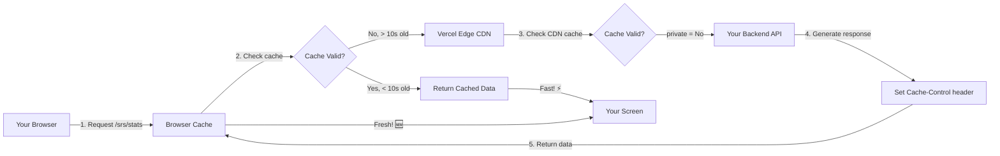
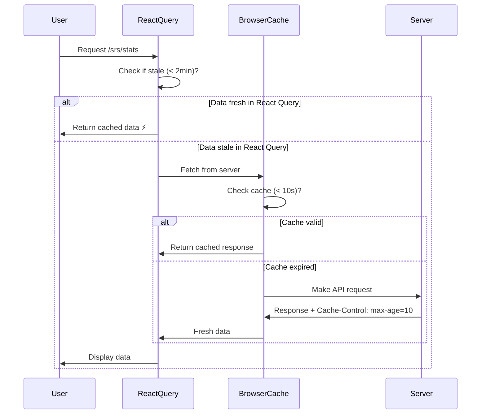

# 📦 HTTP Cache-Control Explained (Beginner-Friendly)

## What is HTTP Caching? (In Simple Terms)

**Cache** = Temporary storage of data so you don't have to fetch it again.

**Simple explanation:** When you visit a website, your browser saves some files/data so the next time you visit, it loads faster (without asking the server again).

---

## Real-World Analogy 📚

Imagine you're a student who needs a textbook from the library.

**Without Caching:**

```
Day 1: Walk to library → Get book → Read → Return book
Day 2: Walk to library → Get same book → Read → Return book
Day 3: Walk to library → Get same book → Read → Return book
(Lots of walking! Time wasted!)
```

**With Caching:**

```
Day 1: Walk to library → Get book → Read → Keep a photocopy
Day 2: Read your photocopy (no library trip!)
Day 3: Read your photocopy (no library trip!)
(Faster! But what if the book is updated?)
```

**Cache with Expiry:**

```
Day 1: Get book → Keep photocopy (valid for 1 week)
Day 5: Read photocopy (still valid)
Day 8: Photocopy expired → Go to library for new copy
```

---

## How It Works in Your IELTS App

### The Problem We're Solving

**Scenario 1: No Caching (Slow but Always Fresh)**

```
User visits dashboard:
1. Browser: "Give me /srs/stats"
2. Server: "Here: { dueToday: 10 }"

User refreshes page (1 second later):
1. Browser: "Give me /srs/stats" (asks again!)
2. Server: "Here: { dueToday: 10 }" (same data!)

Result: Wasted network requests, slower experience
```

**Scenario 2: Infinite Caching (Fast but Stale)**

```
User visits dashboard:
1. Browser: "Give me /srs/stats"
2. Server: "Here: { dueToday: 10 }"
3. Browser: *saves forever*

User studies 5 words, returns to dashboard:
1. Browser: *uses saved data*
2. Shows: { dueToday: 10 } ❌ Wrong! Should be 5!

Result: Fast but shows old/wrong data
```

**Scenario 3: Smart Caching (Fast AND Fresh - Your Setup!)**

```
User visits dashboard:
1. Browser: "Give me /srs/stats"
2. Server: "Here: { dueToday: 10 }"
3. Server: "Cache for 10 seconds only"
4. Browser: *saves for 10 seconds*

User refreshes immediately:
1. Browser: *uses cache* (instant!)
2. Shows: { dueToday: 10 } ✅

User studies 5 words (takes 30 seconds), returns:
1. Browser: "Cache expired! Ask server..."
2. Server: "Here: { dueToday: 5 }"
3. Shows: { dueToday: 5 } ✅ Correct!

Result: Fast AND shows fresh data!
```

---

## Cache-Control Header Explained

### What is it?

It's a message from your backend to the browser saying: "Here's how you should cache this data."

### Your Backend Code

**File:** [`server.ts`](../../apps/backend/src/server.ts)

```typescript
// Auth endpoints: NEVER cache
app.use('/api/v1/auth', (_req, res, next) => {
  res.setHeader('Cache-Control', 'no-store, no-cache');
  next();
});

// SRS endpoints: Cache for 10 seconds
app.use('/api/v1/srs', (_req, res, next) => {
  res.setHeader('Cache-Control', 'private, max-age=10');
  next();
});

// Quiz endpoints: Cache for 60 seconds
app.use('/api/v1/quiz', (_req, res, next) => {
  res.setHeader('Cache-Control', 'private, max-age=60');
  next();
});
```

---

## Understanding Cache-Control Values

### `no-store, no-cache`

**Meaning:** Don't save this data at all. Always ask the server.

**Example:** Login/Logout endpoints

**Why?**

```
You login → GET /auth/me returns your profile
You logout → Browser might show cached profile ❌
Solution: no-cache → Always fresh ✅
```

**Your code:**

```typescript
// Auth endpoints must be fresh always
app.use('/api/v1/auth', (_req, res, next) => {
  res.setHeader('Cache-Control', 'no-store, no-cache');
});
```

---

### `private, max-age=10`

**Meaning:**

- `private` = Only YOUR browser can cache (not CDN/proxy)
- `max-age=10` = Cache for 10 seconds

**Example:** SRS stats (changes when you study)

**Why 10 seconds?**

```
Timeline:
00:00 - View dashboard → Cache /srs/stats for 10s
00:05 - Refresh page → Use cache (instant!)
00:15 - Study a word → Takes time...
00:30 - Return to dashboard → Cache expired → Fresh data! ✅
```

**Your code:**

```typescript
app.use('/api/v1/srs', (_req, res, next) => {
  res.setHeader('Cache-Control', 'private, max-age=10');
});
```

---

### `private, max-age=60`

**Meaning:** Cache for 60 seconds (1 minute)

**Example:** Quiz analytics (changes only after quiz)

**Why 60 seconds?**

```
Quiz takes 5+ minutes to complete
Cache duration: 60 seconds

Flow:
1. View analytics → Cached for 60s
2. Take quiz (5 minutes)
3. Return to analytics → Cache expired → Fresh data! ✅
```

**Your code:**

```typescript
app.use('/api/v1/quiz', (_req, res, next) => {
  res.setHeader('Cache-Control', 'private, max-age=60');
});
```

---

## Why `private` Matters (Vercel/CDN)

### The Problem: Public Caching

When you deploy to Vercel, your app goes through a CDN (Vercel Edge Network).

**Without `private`:**

```
User A → Request /srs/stats → { dueToday: 10 }
         → Vercel Edge caches it publicly

User B → Request /srs/stats → Vercel returns User A's data!
         → Shows { dueToday: 10 } ❌ Wrong! Not User B's data!
```

**With `private`:**

```
User A → Request /srs/stats → { dueToday: 10 }
         → Only User A's browser caches it

User B → Request /srs/stats → Makes fresh API call
         → Shows { dueToday: 5 } ✅ User B's actual data!
```

---

## Visual Flow: Caching Layers



---

## Complete Example: Studying Words

### Timeline with Your Cache Settings

**Initial State:**

```
Dashboard shows: { dueToday: 10, studied: 0 }
```

**User Actions:**

```
Time    Action                          Cache Status              What You See
────────────────────────────────────────────────────────────────────────────────
00:00   View dashboard                  GET /srs/stats            dueToday: 10
        ↓ API call                      Response: max-age=10      ✅ Cached

00:05   Refresh page                    Use cache (5s old)        dueToday: 10
        ↓ No API call                   Still valid ✅            (instant!)

00:15   Study word 1                    POST /srs/review          studying...
        ↓ React Query invalidates       Backend: dueToday = 9

00:16   React Query refetch             Cache still valid?        dueToday: 10
        ↓ Browser blocks!               Yes (16s old > 10s?)      ❌ Old data!
                                        No, 6s old ✅

00:45   Study word 2                    POST /srs/review          studying...
        ↓ React Query invalidates       Backend: dueToday = 8

00:46   React Query refetch             Cache expired!            dueToday: 8
        ↓ API call                      46s > 10s ✅              ✅ Fresh!
```

**Key Point:** Cache duration (10s) is shorter than study time (~30s), so data stays fresh!

---

## Your React Query + Cache-Control

### Two-Layer Caching

You have TWO caching systems working together:

**Layer 1: React Query (Application)**

```typescript
// use-dashboard-data.ts
const { data: srsStats } = useQuery({
  queryKey: ['srs', 'stats'],
  staleTime: 2 * 60 * 1000, // 2 minutes
  queryFn: () => srsApi.getStats(),
});
```

**Layer 2: Browser Cache (HTTP)**

```typescript
// server.ts
res.setHeader('Cache-Control', 'private, max-age=10'); // 10 seconds
```

**How They Work Together:**



**Example:**

```
Scenario: You study a word

1. mutation.mutate() → POST /srs/review
2. onSuccess → queryClient.invalidateQueries(['srs', 'stats'])
3. React Query: "Refetch data!"
4. React Query → Browser: "GET /srs/stats"
5. Browser checks: "Cache < 10s old?"
   - If yes → Returns cached data ❌ (wrong!)
   - If no → Calls API ✅ (fresh data!)

Solution: 10s cache < 30s study time = Usually expired ✅
```

---

## Why Different Durations?

### Auth: `no-cache` (0 seconds)

**Data changes:**

- On login: Not logged in → Logged in
- On logout: Logged in → Not logged in

**Cache duration:** NEVER (always must be fresh)

**Example:**

```
1. You logout
2. Browser shows cached /auth/me → thinks you're logged in ❌
3. Solution: no-cache → Always check server ✅
```

---

### SRS: `max-age=10` (10 seconds)

**Data changes:**

- After EVERY word studied

**Cache duration:** 10 seconds (shorter than study time)

**Example:**

```
Study 1 word = ~20-30 seconds
Cache = 10 seconds
Result: By the time you return, cache expired = fresh data ✅
```

---

### Quiz: `max-age=60` (60 seconds)

**Data changes:**

- Only after quiz completion

**Cache duration:** 60 seconds (much shorter than quiz time)

**Example:**

```
Complete quiz = ~5+ minutes
Cache = 60 seconds
Result: Quiz takes longer than cache = fresh data ✅
```

---

## Testing Cache Behavior

### Test 1: Check Cache Headers

**DevTools → Network → Click a request:**

```
Request URL: https://yourapp.com/api/v1/srs/stats
Response Headers:
  Cache-Control: private, max-age=10  ✅
  Age: 3  (3 seconds since cached)
```

---

### Test 2: Watch Caching in Action

**Open DevTools → Network tab → Disable cache checkbox OFF**

1. Visit dashboard → See GET /srs/stats
2. Refresh immediately → No new request! (using cache)
3. Wait 11 seconds → Refresh → New request! (cache expired)

---

## Key Takeaways

### What is HTTP caching?

Temporarily storing data to load faster without asking the server every time.

### How does Cache-Control work?

Server tells browser: "You can cache this for X seconds."

### Why do we need different durations?

- Auth data: Changes on login/logout → Never cache
- SRS data: Changes frequently → Short cache (10s)
- Quiz data: Changes rarely → Longer cache (60s)

### What is `private`?

Only user's browser caches (not CDN/proxy) → Prevents serving User A's data to User B.

---

## Your Configuration Summary

```typescript
Endpoint          Cache Duration    Why?
─────────────────────────────────────────────────────────────
/api/v1/auth      no-cache         Must always be fresh
/api/v1/srs       10 seconds       Updates after each study
/api/v1/quiz      60 seconds       Updates after quiz
```

**Combined with React Query:**

- HTTP Cache: Fast (browser-level)
- React Query: Smart (application-level)
- Together: ⚡ Fast + 🆕 Fresh!

Your caching strategy is production-optimized! 🎉
