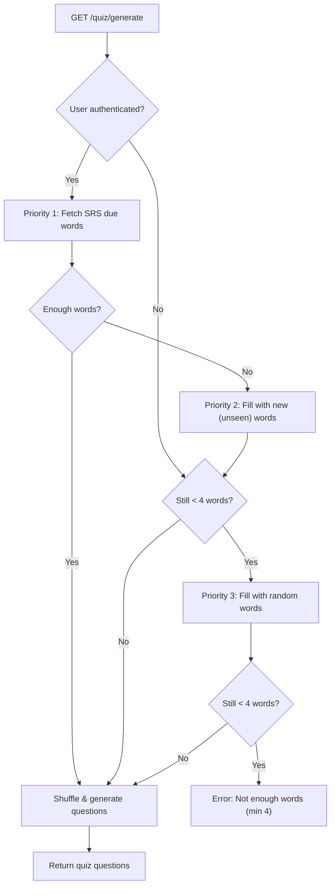

# Quiz System

## Overview

The quiz system generates vocabulary quizzes with **5 different question types**, prioritizing words that need review via the SRS system. Quizzes track per-question timing, calculate XP, and feed results back into the SRS scheduling.

## Quiz Generation Flow



**File:** `apps/backend/src/modules/quiz/quiz.service.ts`

### Word Selection Priority

1. **Due words (SRS):** Words with `nextReviewDate <= now` and `status != mastered`
2. **New words:** Words the user has never studied (no SRS record exists)
3. **Random fallback:** If fewer than 4 words total, fill from the word pool

### Minimum Requirement

A quiz requires **at least 4 words** to generate meaningful multiple-choice options (1 correct + 3 distractors). If fewer than 4 words are available, the API returns a `400` error.

## Question Types

| Type                    | Probability | Question Format                            | Answer Format          |
| ----------------------- | ----------- | ------------------------------------------ | ---------------------- |
| `WORD_TO_MEANING`       | 40%         | "What is the meaning of **X**?"            | 4 meaning options      |
| `MEANING_TO_WORD`       | 30%         | "Which word means **X**?"                  | 4 word options         |
| `SYNONYM_MATCH`         | 15%         | "Select a synonym for **X**"               | 1 synonym + 3 words    |
| `ANTONYM_MATCH`         | 10%         | "Select an antonym for **X**"              | 1 antonym + 3 words    |
| `SENTENCE_COMPLETION`   | 5%          | "Complete: The _____ was remarkable"       | 4 word options         |

### Fallback Behavior

- If a word has **no synonyms**, `SYNONYM_MATCH` falls back to `WORD_TO_MEANING`
- If a word has **no antonyms**, `ANTONYM_MATCH` falls back to `WORD_TO_MEANING`
- If the word doesn't appear in its example sentence, `SENTENCE_COMPLETION` falls back to `WORD_TO_MEANING`

## Question Structure

Each generated question returns:

```typescript
{
  id: string;              // Word ID (used as question identifier)
  type: QuestionType;      // Enum: word_to_meaning, meaning_to_word, etc.
  question: string;        // The question text
  options: Array<{         // 4 shuffled options
    id: string;
    text: string;
  }>;
  correctAnswer: string;   // ID of the correct option
  wordDetails: Word;       // Full word object (for post-answer feedback)
}
```

## Quiz Attempt Saving

**Endpoint:** `POST /quiz/attempts`

When a quiz is completed, the frontend submits:

```typescript
{
  topic?: string;
  difficulty?: string;
  score: number;
  totalQuestions: number;
  startTime: string;       // ISO timestamp
  endTime: string;         // ISO timestamp
  totalTimeSpent: number;  // Milliseconds
  questions: Array<{
    wordId: string;
    selectedAnswer: string;
    correctAnswer: string;
    isCorrect: boolean;
    timeSpent: number;     // Milliseconds per question
    questionType?: string;
    qualityRating?: number; // 0-5 for SRS
  }>;
}
```

### Processing Steps

1. **Validate** request body with Zod schema
2. **Save** quiz attempt to database
3. **Update SRS** — Bulk-review all words with quality ratings
4. **Update user streak** — Using timezone-aware streak logic
5. **Calculate XP** — `score × 10` XP per correct answer
6. **Return** attempt with XP earned

## Quiz Analytics

**File:** `apps/backend/src/modules/quiz/quiz-analytics.service.ts`

### User Analytics (`GET /quiz/analytics/me`)

Returns comprehensive personal statistics:
- Total attempts, questions answered, correct answers
- Average score, best/worst score
- Average time per question
- Performance by difficulty level
- Performance by topic
- Recent attempts (last 5)
- Progress trend (last 10, oldest → newest)

### Global Analytics (`GET /quiz/analytics/global`)

Admin-only endpoint returning:
- Total attempts across all users
- Total unique users who took quizzes
- Global average score
- Most challenging topics (sorted by lowest average score)

### Difficulty Recommendation (`GET /quiz/recommend-difficulty`)

Analyzes the user's last 5 attempts and recommends:

| Condition             | Recommendation | Message                                     |
| --------------------- | -------------- | ------------------------------------------- |
| Avg score > 80%       | `increase`     | "Ready for a harder challenge?"              |
| Avg score < 50%       | `decrease`     | "Trying a lower difficulty might help"       |
| Between 50–80%        | `maintain`     | "You are doing great at this level!"         |
| Fewer than 5 attempts | `maintain`     | "Not enough data yet"                        |

For "mixed" difficulty, thresholds are adjusted (>85% to increase, <40% to decrease).

## Frontend State

**File:** `libs/shared/src/lib/quiz.store.ts`

The quiz store (Zustand, persisted) tracks:
```typescript
{
  lastQuizResult: {
    score: number;
    totalQuestions: number;
    correctAnswers: number;
    difficulty: string;
    timestamp: string;
  } | null;
}
```

Used to display results after quiz completion and for cross-page navigation.
