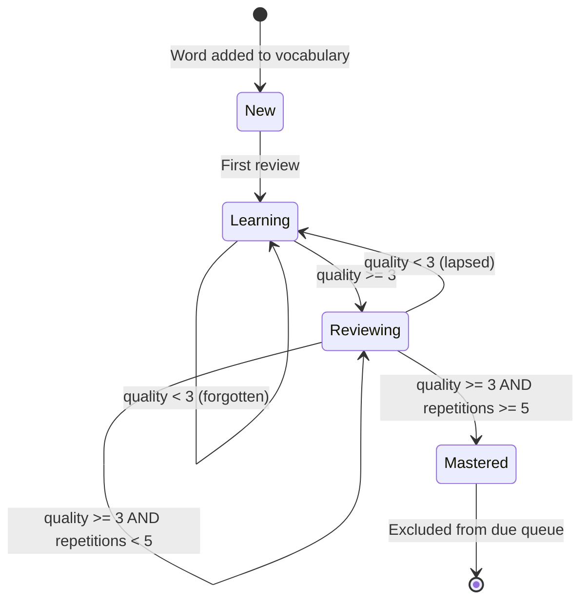

# Spaced Repetition System (SRS) — SM-2 Algorithm

## Overview

The SRS module implements the **SuperMemo-2 (SM-2)** algorithm to optimize vocabulary retention. Words are scheduled for review at increasing intervals based on how well the learner recalls them.

**Reference:** [SuperMemo-2 Algorithm](https://super-memory.com/english/ol/sm2.htm)

## Core Concepts

| Concept         | Description                                                    |
| --------------- | -------------------------------------------------------------- |
| **Quality**     | User's recall rating (0–5) where 0 = complete failure, 5 = perfect recall |
| **Interval**    | Number of days until the next review                           |
| **Repetition**  | Count of consecutive successful reviews (quality ≥ 3)          |
| **Ease Factor** | Multiplier controlling interval growth (min: 1.3, default: 2.5)|
| **Lapse Count** | How many times the user forgot a word (quality < 3)            |

## SRS Status Lifecycle



## SM-2 Algorithm Implementation

**File:** `apps/backend/src/shared/lib/srs-utils.ts`

### Input Parameters

```typescript
interface SM2Input {
  quality: number;        // 0–5 recall rating
  prevInterval: number;   // Previous interval in days
  prevRepetitions: number;// Previous consecutive successful reviews
  prevEaseFactor: number; // Previous ease factor
}
```

### Algorithm Steps

**Step 1 — Calculate New Interval:**

```
If quality >= 3 (successful recall):
  - First review (repetitions = 0):  interval = 1 day
  - Second review (repetitions = 1): interval = 6 days
  - Subsequent reviews:              interval = round(prevInterval × prevEaseFactor)
  - Increment repetitions

If quality < 3 (failure):
  - Reset repetitions to 0
  - Reset interval to 1 day
```

**Step 2 — Update Ease Factor:**

```
newEaseFactor = prevEaseFactor + (0.1 - (5 - quality) × (0.08 + (5 - quality) × 0.02))
```

This formula adjusts the ease factor based on performance:
- Perfect recall (5): ease factor increases by +0.10
- Good recall (4): ease factor increases by +0.00
- Acceptable (3): ease factor decreases by −0.14
- Poor (2): ease factor decreases by −0.32
- Very poor (1): ease factor decreases by −0.54
- Complete failure (0): ease factor decreases by −0.80

**Step 3 — Enforce Minimum Ease Factor:**

```
if (easeFactor < 1.3) easeFactor = 1.3
```

### Output

```typescript
interface SM2Output {
  interval: number;    // New interval in days
  repetitions: number; // New repetition count
  easeFactor: number;  // Updated ease factor
}
```

### Next Review Date

```typescript
function getNextReviewDate(interval: number): Date {
  const date = new Date();
  date.setDate(date.getDate() + interval);
  return date;
}
```

## SRS Service Operations

**File:** `apps/backend/src/modules/srs/srs.service.ts`

### `reviewWord(userId, wordId, quality, timezone?)`

1. Finds or creates an SRS item for the user-word pair
2. Calculates new SM-2 parameters
3. Updates status based on quality and repetition count
4. Updates user's streak (using the same logic as quiz completion)
5. Saves the SRS item

### `bulkReview(userId, reviews[])`

Optimized batch operation using MongoDB `bulkWrite`:
1. Fetches all existing SRS items in one query
2. Calculates SM-2 for each review
3. Executes all updates in a single `bulkWrite` with `upsert: true`

### `getDueWords({ userId, topicId?, difficulty?, limit })`

Retrieves words due for review using an aggregation pipeline:
1. Match SRS items where `nextReviewDate <= now` and `status != mastered`
2. Join with `words` collection for word details
3. Apply topic/difficulty filters
4. Populate topic references
5. Limit results

### `getNewWords(userId, topicId?, difficulty?, limit)`

Finds words the user has never studied:
1. Filter words by topic/difficulty
2. Left-join with `srsitems` to check if user has studied each word
3. Exclude words with any SRS record (`isStudied: []`)
4. Populate topics and limit results

### `getStats(userId)`

Returns a summary of the user's SRS progress:
```json
{
  "totalWords": 150,
  "learning": 30,
  "reviewing": 80,
  "mastered": 40,
  "dueToday": 12,
  "newToday": 500
}
```

Uses `$facet` aggregation for efficient single-query counting.

### `getWordStatus(userId, wordId)`

Returns the SRS state of a specific word for a user, or `{ status: 'new' }` if unseen.

### `getReviewSchedule(userId, days)`

Returns upcoming reviews grouped by date for the next N days (default: 7).

## Quality Rating Guide

| Rating | Meaning                          | Effect on SRS                    |
| ------ | -------------------------------- | -------------------------------- |
| 5      | Perfect recall, instant          | Increases interval significantly |
| 4      | Correct with slight hesitation   | Increases interval moderately    |
| 3      | Correct but with difficulty      | Increases interval minimally     |
| 2      | Incorrect, but recognized answer | Resets progress (lapse)          |
| 1      | Incorrect, vaguely familiar      | Resets progress (lapse)          |
| 0      | Complete blackout                | Resets progress (lapse)          |

## Integration with Quiz System

When a quiz attempt is saved, each question's result can generate a `qualityRating` (0–5) that is used for SRS updates. The quiz attempt service integrates with SRS via `SRSService.bulkReview()`, allowing the quiz to automatically update word scheduling.
