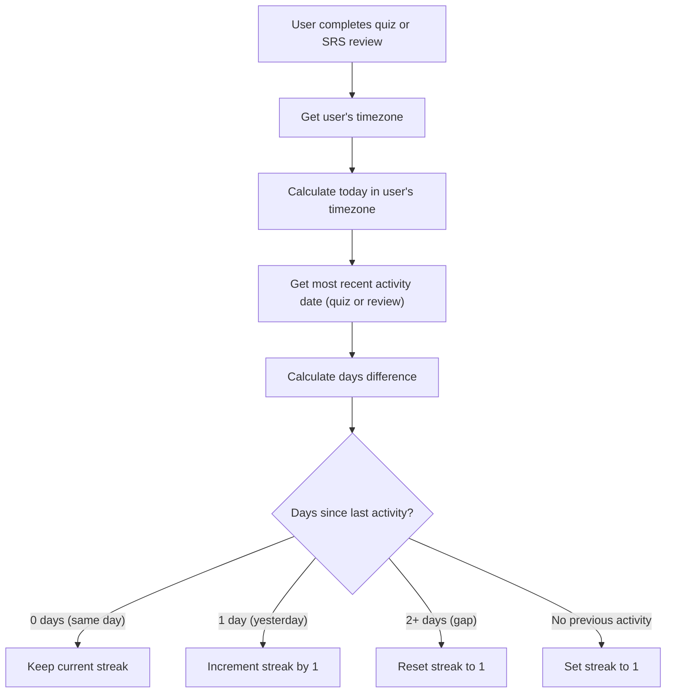
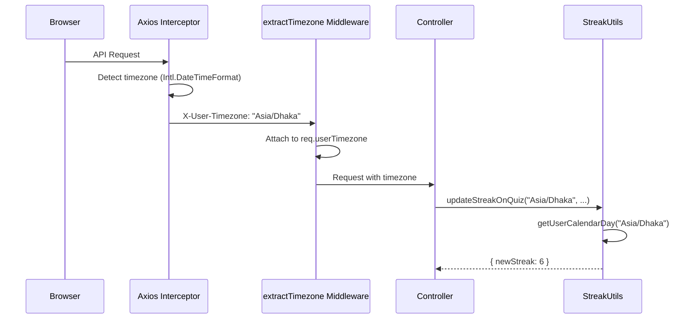

# Streak System

## Overview

The streak system tracks consecutive days of learning activity. A streak increments when a user completes a quiz or SRS review on a new calendar day. The system is **timezone-aware**, ensuring streaks are calculated based on the user's local day, not UTC.

## How Streaks Work



## Streak Logic

**File:** `apps/backend/src/modules/users/streak-utils.ts`

### Key Rules

1. **Activity counts:** Both quiz completions AND SRS reviews count as activity
2. **Most recent wins:** The system uses whichever is more recent — `lastQuizDate` or `lastReviewDate`
3. **Same day = no change:** Multiple activities on the same day don't increment the streak
4. **Next day = increment:** Activity on the consecutive calendar day adds +1
5. **Gap of 2+ days = reset:** Missing a full day resets the streak to 1 (the current day counts)
6. **No history = start at 1:** First-ever activity starts the streak at 1

### Calendar Day Calculation

```typescript
static getUserCalendarDay(timezone: string, now: Date = new Date()): Date
```

Converts a UTC date to the user's local calendar day by:
1. Formatting the date in the user's timezone via `toLocaleString('en-US', { timeZone })`
2. Extracting only the year, month, and day (zeroing out time components)

This ensures that "today" means the user's local today, not UTC today. For example, a user in `Asia/Dhaka` (UTC+6) completing a quiz at 11 PM local time gets credit for that day even though it's already the next day in UTC.

### Days Difference

```typescript
static getDaysDifference(date1: Date, date2: Date): number
```

Calculates the integer number of days between two dates using UTC date components, avoiding timezone-related floating point issues.

## Streak Update (Active)

**Method:** `StreakUtils.updateStreakOnQuiz(timezone, lastQuizDate, lastReviewDate, currentStreak)`

Called when a user completes a quiz or SRS review:

| Scenario                          | Result                         |
| --------------------------------- | ------------------------------ |
| No previous activity              | `newStreak: 1`                 |
| Last activity was today           | `newStreak: currentStreak` (unchanged) |
| Last activity was yesterday       | `newStreak: currentStreak + 1` |
| Last activity was 2+ days ago     | `newStreak: 1` (reset + today) |

Returns `{ newStreak, streakIncremented }`.

## Streak Check (Passive)

**Method:** `StreakUtils.checkAndResetStreak(timezone, lastQuizDate, lastReviewDate, currentStreak)`

Called when the user views their dashboard (via `GET /auth/me`):

- If 2+ days have passed since the last activity, the streak is reset to 0
- If 0–1 days, the streak remains unchanged
- This happens **passively** — the user doesn't need to do anything

### Optimization: Daily Check Guard

```typescript
static shouldCheckStreak(timezone: string, lastStreakCheckDate: Date | null): boolean
```

To avoid redundant database writes, the system tracks `lastStreakCheckDate` on the user document. If the streak was already checked today (in the user's timezone), the check is skipped.

## Timezone Flow



### Timezone Priority

1. `X-User-Timezone` header (auto-detected by browser)
2. Previously stored `user.timezone` in database
3. Fallback: `'UTC'`

## Where Streaks Are Updated

| Trigger              | Endpoint                | Method Called          |
| -------------------- | ----------------------- | ---------------------- |
| Quiz completion      | `POST /quiz/attempts`   | `updateStreakOnQuiz()` |
| SRS word review      | `POST /srs/review`      | `updateStreakOnQuiz()` |
| Dashboard visit      | `GET /auth/me`          | `checkAndResetStreak()`|
| Profile view         | `GET /users/profile`    | `checkAndResetStreak()`|

## Related User Fields

| Field                | Purpose                                          |
| -------------------- | ------------------------------------------------ |
| `streak`             | Current consecutive days count                   |
| `lastQuizDate`       | Timestamp of last quiz completion                |
| `lastReviewDate`     | Timestamp of last SRS review                     |
| `timezone`           | User's IANA timezone (e.g., `'Asia/Dhaka'`)      |
| `lastStreakCheckDate` | Optimization: prevents duplicate daily checks   |
